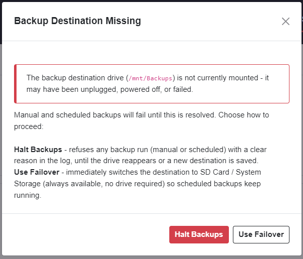

# Troubleshooting

[← Back to README](../README.md)

## SSH key failures

Checking a remote's box (or manually adding one) pushes the Host's dedicated backup SSH
key to it automatically in the background - see [How Remote Backup
Works](how-it-works.md). This section covers what it looks like when that fails, and how
to fix each case. All of this is handled by `scripts/ssh_setup.sh`, whether it's fired
automatically on selection or manually via the "Push SSH Key" button.

### "key push failed - click 'Push SSH Key' to retry with a password"

Shown next to a remote on the Config page right after the automatic push (on
check/manual-add) fails. This is a summary status, not the actual error - click **Push
SSH Key** to see (and fix) what actually went wrong; it opens a password prompt and
retries, and any failure from that retry shows as a toast with the specific reason
(see below).

The most common cause by far is a **password mismatch**: the automatic push tries the
Config page's "SSH password" field if set, otherwise FPP's factory default `falcon` - if
the remote's actual `fpp` user password is something else (changed at some point, or a
custom image), the silent automatic attempt fails. Click **Push SSH Key** and enter the
remote's actual current password.

### "sshpass is not installed on the Host."

The Host is missing `sshpass`, which `ssh_setup.sh` needs to supply a password
non-interactively. `fpp_install.sh` installs it automatically, so this normally only
shows up if it was later removed from the system some other way. Fix: `sudo apt-get
install -y sshpass` on the Host, or skip the button entirely and copy
`~fpp/.ssh/id_rsa_remotebackup.pub` to the remote's `~fpp/.ssh/authorized_keys` by hand.

### "No local SSH key found; re-run the plugin install script."

The Host's own dedicated keypair (`~fpp/.ssh/id_rsa_remotebackup` /
`id_rsa_remotebackup.pub`) is missing - normally only possible if it was deleted outside
the plugin after install. Fix: re-run `scripts/fpp_install.sh` on the Host to regenerate
it, then push the key to each remote again.

### "Timed out connecting/authenticating to `<address>`."

The Host couldn't reach the remote at all within the connection window. Check that the
address/port in the remote's row (or Config's SSH port setting) are correct, that the
remote is powered on and actually reachable on the network from the Host, and that
nothing (a firewall, a VPN, a wrong subnet) is blocking port 22 (or whatever port is
configured) between them.

### "Key push failed (rc=N): `<raw ssh output>`"

The catch-all for anything `ssh`/`sshpass` itself reported that doesn't match one of the
cases above - the raw error text from the attempt is included directly in the message.
Common text to look for inside it:

- **`Permission denied, please try again.`** (possibly repeated) - the password sent was
  wrong. Same fix as the password-mismatch case above: click **Push SSH Key** and enter
  the remote's actual password.
- **`Connection refused`** - something is listening at that address but nothing is
  accepting SSH connections on the configured port; check the remote's `sshd` is running
  and the port is correct.
- **`No route to host`** - a network-level problem reaching the address at all (routing,
  the remote is actually offline, wrong subnet/VLAN).
- **`Could not resolve hostname`** - only relevant if the remote was added by hostname
  rather than IP and that hostname doesn't resolve from the Host; add or re-add the
  remote using its IP address instead as a workaround.

### A reimaged/rebuilt remote ("new SD/boot device")

A remote that keeps the same IP/hostname but gets new SSH host keys (a fresh SD card, a
factory reset, a from-scratch rebuild) would normally make *every* SSH connection to it
fail outright with `REMOTE HOST IDENTIFICATION HAS CHANGED`, regardless of password. This
plugin clears any stale `known_hosts` entry for a remote's address before every
connection attempt it makes (both the automatic push and the manual "Push SSH Key"
button use the same script), so this specific failure is already handled automatically -
you should not normally see it. If the rebuilt remote's password also changed (e.g. it's
back to the factory default `falcon` after previously having been customized, or vice
versa), that's a plain password mismatch - see above.

### The push reports success, but backups still fail with "Permission denied (publickey)"

This shows up in a remote's own rsync log, or in that remote's error summary on the
Status page, once an actual backup or dry run is attempted - not during the key push
itself. The backup/dry-run connection (`scripts/run_backup.sh`) authenticates with the
key only, no password fallback, so this means the key was never actually accepted by
that remote despite what the Config page's status showed. The rarer cause is wrong
permissions on the remote's `~/.ssh` directory or `authorized_keys` file - `sshd` will
silently ignore an `authorized_keys` file it considers too permissive, which looks
identical to "the key just isn't there" from the Host's side. `ssh_setup.sh` always fixes
these permissions (`700`/`600`) itself as part of a push through this plugin, so this is
only really a risk if the key was ever copied to that remote by some other means (a
manual `scp`, a different tool). Fix: click **Push SSH Key** again to re-push through
this plugin, which corrects the permissions along with the key itself.

## Backup Destination Missing

If a configured destination drive (USB/NVMe/SSD, anything other than the SD Card/System
Storage fallback) stops being found mounted, a popup titled **"Backup Destination
Missing"** appears on whichever of the Status or Config page happens to be open at the
time - each page checks independently, so it doesn't matter which one you have up:

It offers two choices:

- **Halt Backups** - refuses any backup run, manual or scheduled, with a clear reason
  (`data/logs/engine.log`, and FPP's own Scheduler command output for a scheduled run) for
  as long as the situation is unresolved. Use this if you want to investigate (is the
  drive unplugged? did it fail?) before deciding where backups should go next.
- **Use Failover** - immediately switches the destination to SD Card / System Storage
  (the same fallback option always shown in the Config page's storage list) - always
  available since it's just the filesystem root, no drive to plug in or format. Backups
  resume on the next scheduled or manual run, written into a dedicated
  `/home/fpp/media/backups` folder, same as if you'd selected that option yourself. Both
  choices take effect immediately - neither needs a separate "Save Settings" click.

**The popup only appears once per "episode."** It won't re-appear on every poll while the
drive is still missing and you haven't picked yet, and it stays quiet once you've picked
Halt (repeating it would be pure noise - the situation is already handled). It resets and
can appear again the next time the same, or a different, destination goes missing.

**A halt clears itself automatically** - no separate "resume" step needed - the moment
either of these happens:

- The missing drive is seen mounted again at its usual mountpoint (see "Plugging the
  drive back in" below - this takes a couple of manual steps, not just reconnecting it).
- A different destination is saved on the Config page (picking a new one is itself
  the fix).

Choosing **Use Failover** clears it too, immediately, as part of switching the
destination to "/" - which can never itself be reported as "missing," since the root
filesystem always exists.

### Plugging the drive back in doesn't automatically resolve this

Physically reconnecting the same USB drive (or powering it back on) does **not** get it
automatically remounted, and the popup/halt won't clear on its own just because the
drive is physically present again. This plugin's `/etc/fstab` entry only remounts a
drive at *boot time* - there's no hot-plug automount set up (no udev rule, no systemd
automount unit), which is deliberate: the same "type the device path to confirm" safety
model used for Format applies here too, so a drive never gets silently claimed as the
destination again without a step you can see happening.

To actually bring it back:

1. Open the Config page (if it isn't already the one you have up).
2. Click **"Rescan Storage Devices"** - the drive won't show up in the mounted list
   until this runs; simply having reconnected it isn't enough for the plugin to notice.
3. It reappears under **"USB drive(s) detected but not mounted."** Click **"Mount as
   Backups"** next to it (see [Setting up a USB backup drive](usb-drive-setup.md)) -
   Mount now also pre-selects it as the destination automatically, so this one click is
   generally all that's needed on the Config side.
4. Once mounted, the next `status` poll (Status or Config page, whichever is open) sees
   the destination present again and clears the halt automatically - no separate
   "resume" button to find.

## Backup Space Insufficient

Every real backup run (manual or scheduled) starts with a pre-flight check: an estimate
of the total transfer size across every selected remote, compared against the
destination's free space right at that moment - the same `rsync --dry-run` pass a
regular Dry Run does, so it correctly credits files that already exist on the
destination instead of assuming a full re-copy every time. If the estimate exceeds
what's actually free, the run is refused before anything is copied, and a **"Backup
Space Insufficient"** popup appears on whichever of the Status or Config page happens to
be open:

- **Start Anyway** - proceeds despite the warning. Useful if the estimate looks stale
  (e.g. you just freed up space) - the transfer may still only partially complete if it
  genuinely doesn't fit, same as before this check existed.
- **Replace Destination** - pick any other currently-mounted drive with enough room for
  the estimated transfer, right from the popup.
- **Use Failover** - switch to SD Card / System Storage (always available, no drive
  required).
- **Cancel** - leave it refused. Nothing runs again until you come back and pick one of
  the above, or fix the space situation yourself and try again.

Picking Start Anyway, Replace Destination, or Use Failover automatically retries the
backup right away, using whatever's currently selected on the Config page - you don't
need to click Start Backup again yourself.

**Why this only shows up after a run was attempted, not before you click Start.**
Unlike a missing drive (a fact that's true or false at any moment, checked continuously),
"will this fit" requires actually estimating the transfer size, which takes real time -
there's no cheap way to know in advance. So the check happens as part of every real run
itself, and the popup reflects a run that was just refused, not a warning shown before
you've clicked anything.

**A scheduled run has nobody to answer that popup**, so it applies a fixed policy
instead: refuse and log a clear reason (same as a manual run, just with no popup for
anyone to see until they next open the Status or Config page), unless **"If a scheduled
run's destination doesn't have enough free space, switch automatically to SD Card /
System Storage"** is turned on in Config's Backup Options - off by default, so a
scheduled backup never lands somewhere unexpected without you having explicitly opted
into that.

**The pre-flight check adds real time to every real run** - it's doing a full
Dry-Run-equivalent pass before the actual transfer starts, not a cheap instant check.
For a large or many-remote backup, expect the run to take noticeably longer overall than
it did before this existed. There's no setting to skip it entirely; `--skip-space-check`
(used internally by "Start Anyway") is the only way past it, and it only applies to that
one retry.

## Remote Playing a Sequence

Before a real run touches anything, every selected remote's own FPP API is checked for
whether it's currently playing a sequence - pulling media off a device's SD card while its
own fppd is actively reading those same files risks stutters or dropped frames during a
live show. Config's Backup Options has a setting for what happens next:

- **Stop the whole backup (default)** - refuses the *entire* run, not just the busy
  remote, with a clear reason logged (`data/logs/engine.log`, and FPP's own command output
  for a scheduled run). A manual Start Backup/Dry Run click shows this as an immediate
  error toast instead of even starting.
- **Skip that remote and back up the others instead** - leaves just the busy remote(s) out
  of this run and proceeds with everything else selected. The busy remote's own SD card is
  never read either way, but its own status entry on the Status page shows as **Skipped
  (playing)** rather than silently not appearing, and a manual click gets an immediate
  toast naming who's being skipped. **Worth knowing:** the *other* remotes' rsync transfers
  still run on the same network while the busy one's show is live - that's its own possible
  source of contention/timing risk for a synced show, even though nothing reads from the
  playing device directly. If every selected remote turns out to be playing at once,
  skipping down to nothing is treated the same as Stop - the whole run is refused rather
  than "completing" having backed up nothing.

**A scheduled run has nobody to answer for itself**, so whichever policy is selected just
applies outright, same as a manual run's outcome minus the live toast. Since nobody's
watching it happen, the next time the Status or Config page is opened after a scheduled run
actually hit this (refused entirely, or skipped at least one remote), a one-time popup
titled **"Scheduled Backup - Remote(s) Playing"** reports what happened and, under Skip,
which device(s) were left out. Unlike Backup Destination Missing/Space Insufficient above,
this popup reports something that already finished, not an ongoing condition - it doesn't
come back on a page reload, only clicking its OK button (or a *later* scheduled run hitting
this same situation again) clears it.

## Settings Reset to Defaults

If Config suddenly shows every setting back at its default (destination cleared, remote
list empty, options unchecked) with no changes made on purpose, `data/settings.json` itself
became empty or invalid - this has been observed to happen from something entirely outside
this plugin, e.g. an OS/FPP update restarting the web server at exactly the wrong moment.
Nothing about a normal Save Settings, a halt/failover, or any of this plugin's own writes
can produce that outcome (they're all atomic write-then-rename), so if it happens it's worth
suspecting whatever else changed on the system around the same time.

As of this fix, `data/settings.json.bak` is kept alongside the live file - a plain mirror
updated on every successful settings write, whether that write came from the Config page or
from a script (e.g. auto-failover switching the destination). If the live file is ever found
empty or unreadable, it's restored automatically from that backup the next time anything
touches it - a page load, an ajax request, or even just a script sourcing
`scripts/lib_common.sh` - so this should now self-heal within moments rather than silently
running on empty defaults indefinitely (which is what happened before this fix existed: the
live file stayed broken forever, since nothing ever checked or repaired it, and every single
request just kept re-reading defaults with no way back short of noticing and re-entering
every setting by hand). `data/logs/engine.log` and `data/logs/ajax.log` log a `RECOVERED
settings.json from settings.json.bak` line when this happens. If both the live file and the
backup are found broken at the same time (much less likely, but possible if the same event
hit both), it falls back to plain defaults and persists those instead, rather than
continuing to fail on every request.
